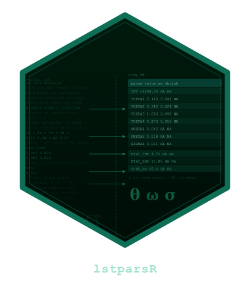

# lstparsR 

<!-- badges: start -->
[](https://github.com/Clinical-Pharmacy-Saarland-University/lstparsR/actions/workflows/R-CMD-check.yaml)
[](https://clinical-pharmacy-saarland-university.github.io/lstparsR/)
[](https://CRAN.R-project.org/package=lstparsR)
[](https://app.codecov.io/gh/Clinical-Pharmacy-Saarland-University/lstparsR?branch=main)
[](https://cran.r-project.org/package=lstparsR)
[](https://cran.r-project.org/package=lstparsR)
[](https://opensource.org/licenses/MIT)
[](https://lifecycle.r-lib.org/articles/stages.html#experimental)
<!-- badges: end -->

**lstparsR** reads NONMEM `.lst` output files and extracts parameter
estimates into tidy data frames for downstream population PK/PD analysis.

## Features

- Parses THETA, OMEGA (diagonal), and SIGMA (diagonal) estimates
- Extracts standard errors, relative standard errors, and ETA shrinkage
- Reports objective function value (OFV) and condition number
- Handles multi-line parameter blocks (any number of THETAs/ETAs)
- Returns `NA` gracefully when the covariance step is absent or the run
  failed -- safe for use in automated pipelines
- Supports FOCE-I, FOCE, FO, SAEM, IMP, IMPMAP, and Bayesian methods
- Includes an interactive Shiny app for point-and-click exploration

## Installation

Install the development version from GitHub:

```r
# install.packages("remotes")
remotes::install_github("Clinical-Pharmacy-Saarland-University/lstparsR")
```

CRAN release (planned):

```r
install.packages("lstparsR")
```

## Quick Start

```r
library(lstparsR)

# Read a listing file
lst <- read_lst_file("run001.lst")

# Extract everything at once
result <- fetch_all(lst)
result$thetas
#> # A tibble: 12 x 4
#>    parameter estimate       se      rse
#>    <chr>        <dbl>    <dbl>    <dbl>
#>  1 TH_1        34.1     3.37      9.88
#>  2 TH_2    387000    5.41e+7  13979.
#>  ...

result$ofv
#> [1] 8986.318
```

## Function Reference

| Function | Description |
|---|---|
| `read_lst_file()` | Read a `.lst` file into an `lst` object |
| `fetch_thetas()` | Extract THETA estimates with SE and RSE |
| `fetch_etas()` | Extract OMEGA diagonal with SE, RSE, and shrinkage |
| `fetch_sigmas()` | Extract SIGMA diagonal with SE and RSE |
| `fetch_ofv()` | Extract the objective function value |
| `fetch_condn()` | Compute condition number from eigenvalues |
| `fetch_all()` | Run all parsers and return a named list |
| `run_app()` | Launch the interactive Shiny application |

## Individual Parsers

```r
lst <- read_lst_file("run001.lst")

# Fixed effects
fetch_thetas(lst)

# Random effects (with shrinkage)
fetch_etas(lst)

# Residual error
fetch_sigmas(lst)

# Scalar summaries
fetch_ofv(lst)
fetch_condn(lst)
```

## Handling Failed Runs

When a NONMEM run did not converge or the covariance step was skipped,
`lstparsR` returns `NA` for unavailable quantities instead of raising
errors. This is critical for automated workflows (e.g., pyDARWIN, PsN)
where hundreds of runs are parsed at once:

```r
lst_fail <- read_lst_file("failed_run.lst")
fetch_ofv(lst_fail)       # NA or fallback footer value
fetch_condn(lst_fail)     # NA
fetch_all(lst_fail)       # thetas/etas/sigmas = NULL, ofv/condn = NA
```

## Interactive Shiny App

Launch a browser-based interface for uploading and parsing `.lst` files:

```r
lstparsR::run_app()
```

The app lets you upload one or more `.lst` files, view parsed results in
interactive tables, and download them as CSV or RDS.

## Citation

```r
citation("lstparsR")
```

## License

MIT
