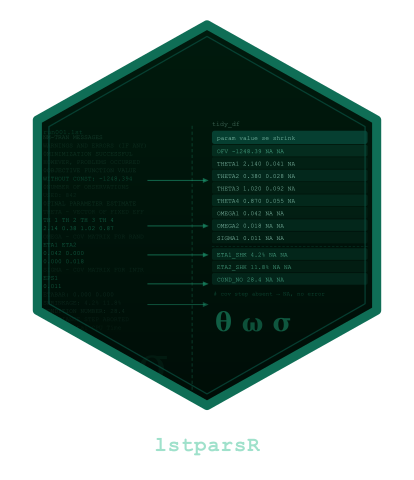

# lstparsR 

<!-- badges: start -->
[](https://github.com/Clinical-Pharmacy-Saarland-University/lstparsR/actions/workflows/R-CMD-check.yaml)
[](https://clinical-pharmacy-saarland-university.github.io/lstparsR/)
[](https://app.codecov.io/gh/Clinical-Pharmacy-Saarland-University/lstparsR?branch=main)
[](https://opensource.org/licenses/MIT)
[](https://lifecycle.r-lib.org/articles/stages.html#experimental)
<!-- badges: end -->

**lstparsR** reads NONMEM `.lst` output files and extracts parameter
estimates into tidy data frames for downstream population PK/PD analysis.

## Features

- Parses THETA, OMEGA (diagonal), and SIGMA (diagonal) estimates
- Extracts standard errors, relative standard errors, and ETA shrinkage
- Reports objective function value (OFV) and condition number
- Handles multi-line parameter blocks in the documented output layouts
- Returns `NA` for missing optional quantities; `fetch_all()` retains partial
  results and warns when an individual parser fails
- Recognizes FOCE-I, FOCE, FO, SAEM, IMP, IMPMAP, and Bayesian method headers
- Includes an interactive Shiny app for point-and-click exploration

## Installation

Install the development version from GitHub:

```r
# install.packages("remotes")
remotes::install_github("Clinical-Pharmacy-Saarland-University/lstparsR")
```

A first CRAN submission is being prepared.

## Quick Start

```r
library(lstparsR)

# Read a listing file
lst <- read_lst_file("run001.lst")

# Extract everything at once
result <- fetch_all(lst)
result$thetas
#> # A tibble: 12 x 4
#>    parameter estimate       se      rse
#>    <chr>        <dbl>    <dbl>    <dbl>
#>  1 TH_1        34.1     3.37      9.88
#>  2 TH_2    387000    5.41e+7  13979.
#>  ...

result$ofv
#> [1] 8986.318
```

## Function Reference

| Function | Description |
|---|---|
| `read_lst_file()` | Read a `.lst` file into an `lst` object |
| `fetch_thetas()` | Extract THETA estimates with SE and RSE |
| `fetch_etas()` | Extract OMEGA diagonal with SE, RSE, and shrinkage |
| `fetch_sigmas()` | Extract SIGMA diagonal with SE and RSE |
| `fetch_ofv()` | Extract the objective function value |
| `fetch_condn()` | Compute condition number from eigenvalues |
| `fetch_all()` | Run all parsers and return a named list |
| `run_app()` | Launch the interactive Shiny application |

## Individual Parsers

```r
lst <- read_lst_file("run001.lst")

# Fixed effects
fetch_thetas(lst)

# Random effects (with shrinkage)
fetch_etas(lst)

# Residual error
fetch_sigmas(lst)

# Scalar summaries
fetch_ofv(lst)
fetch_condn(lst)
```

## Handling Failed Runs

Missing optional quantities, such as standard errors without a covariance
step, are returned as `NA`. Direct parameter parsers raise errors when their
required sections are absent. For batch workflows, `fetch_all()` catches
individual parser errors, warns, and returns `NULL` for the failed elements:

```r
lst_fail <- read_lst_file("failed_run.lst")
fetch_ofv(lst_fail)       # NA or fallback footer value
fetch_condn(lst_fail)     # NA
fetch_all(lst_fail)       # thetas/etas/sigmas = NULL, ofv/condn = NA
```

## Interactive Shiny App

Launch a browser-based interface for uploading and parsing `.lst` files:

```r
lstparsR::run_app()
```

The app lets you upload one or more `.lst` files, view parsed results in
interactive tables, and download them as CSV or RDS.

## Citation

```r
citation("lstparsR")
```

## License

MIT

All parsers select the final problem and estimation step using NONMEM's
`#PROB:` and `#METH:` markers when present. Legacy listings with multiple
result pages use the final parameter page and its objective-function header.
A failed final step does not fall back to earlier results. Missing quantities
remain unavailable; warnings identify incomplete or unrecognized output.
Condition numbers are infinite for zero eigenvalues and unavailable, with a
warning, for negative eigenvalues.

## Output layout coverage

The parsers read the fixed-format final parameter, standard-error and diagnostic
sections illustrated by the bundled examples. Numerical regression tests cover
FOCE-I listings and controlled edge cases. FO listings have additional execution
coverage. Recognition of FOCE, SAEM, IMP, IMPMAP or Bayesian method headers does
not establish support for every output layout or posterior summary produced by
those methods. Compare parsed values with the source listing before relying on
an unfamiliar layout. These parsers do not assess the validity of a fitted model.
